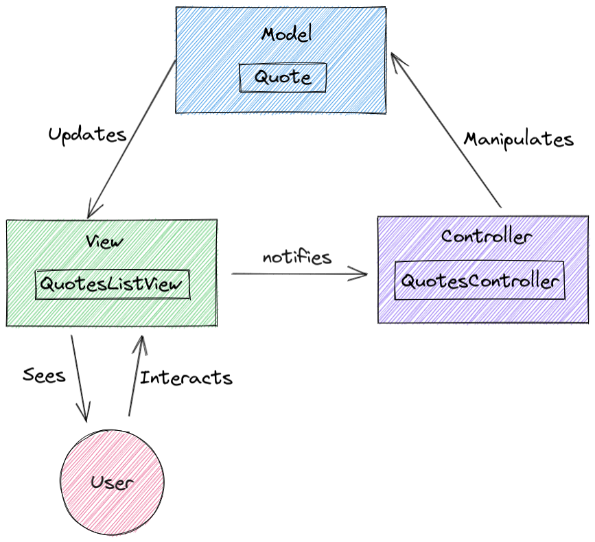
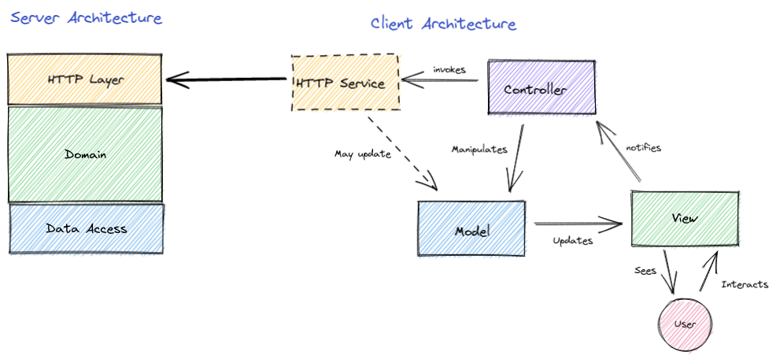

# The-Quotes

##Overall Architecture

The overall architecture of the system consist of a  server that has an HTTP API and connect to SQL, and mobile client that calls the server.

The server consist of a layered architecture that separates the HTTP code from the domain code and the database access code. 

##  MVC pattern

## Connect the Client and the Server

